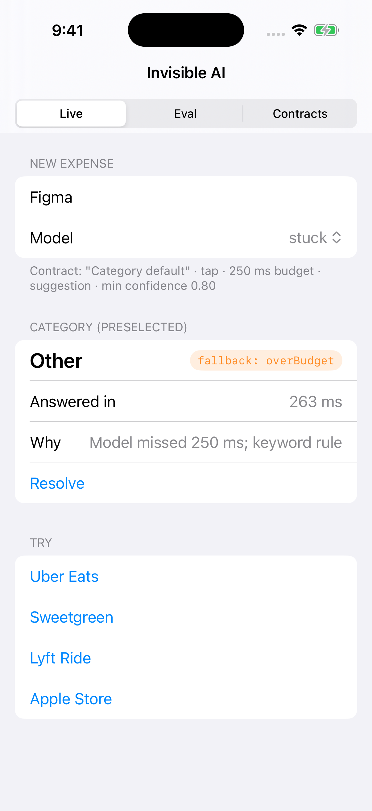
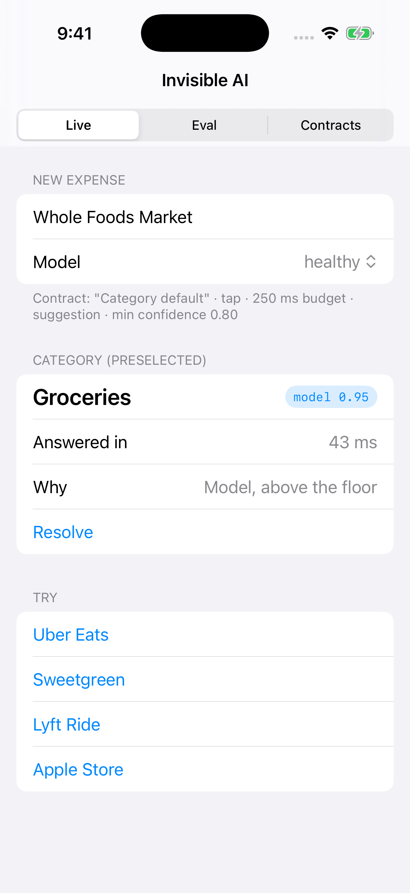
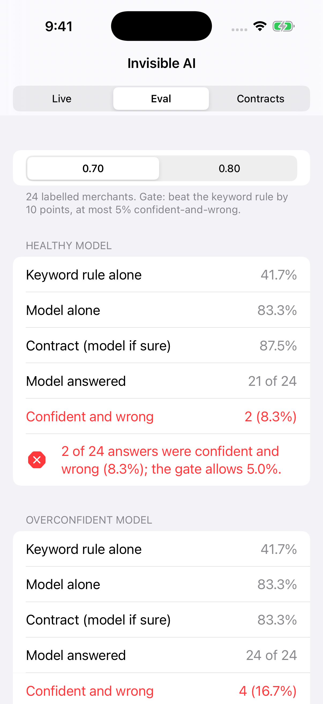
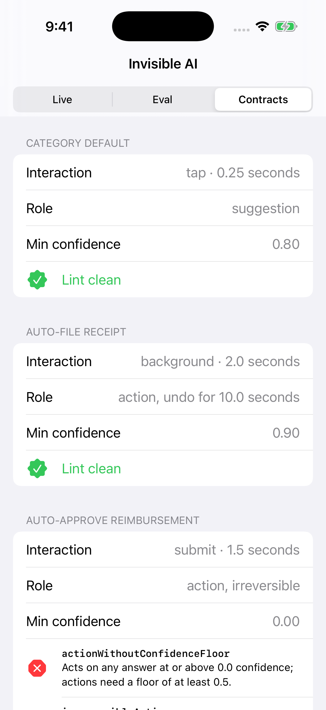

# InvisibleAI: a failure-mode contract for AI features nobody calls "AI"

Article: (added after publish)

An AI-enhanced feature with no chat box is harder to ship than a chat tab. When a chat answer is wrong, the user sees it. When a preselected category or an auto-filed receipt is wrong, nobody does. This package makes each AI-enhanced feature declare what happens when the model is **unavailable, slow or wrong** before it ships, and then checks that declaration in code.



## What's in it

| Type | What it does |
|---|---|
| `FailureModeContract<Input, Output>` | One per feature: interaction, latency budget, role (`suggestion` or `action` with an undo policy), confidence floor, eval gate, and a **required** deterministic `fallback`. A contract without a fallback does not compile. |
| `resolve(_:using:)` | Races the model against the budget. Falls back on `unavailable`, `overBudget` or `lowConfidence`. Built on a resume-once continuation rather than a task group, so a model that ignores cancellation cannot hold the UI past its budget (see `testNaiveTaskGroupRaceWaitsForStuckModel`). |
| `ContractLinter` | CI-able rules: irreversible actions, actions with no confidence floor, budgets over the interaction's ceiling, missing eval gates, gates that let the model ship without beating the fallback. |
| `evaluate(_:using:)` → `EvalReport` | Offline golden-set run: fallback accuracy, model accuracy, contract accuracy, coverage and **silent errors** (confident and wrong). |
| `SurfaceRubric` | When a chat UI *is* the right call: open answer space, a user who knows what to ask, and real back-and-forth. Otherwise, embed it. |
| `SampleExpenses` | A constructed 24-merchant expense-categorisation example and a scripted model with five conditions: `healthy`, `slow`, `stuck`, `offline`, `overconfident`. |

```swift
let categoryDefault = FailureModeContract<String, ExpenseCategory>(
    feature: "Category default",
    interaction: .tap,
    budget: .milliseconds(250),
    role: .suggestion,
    minConfidence: 0.80,
    evalGate: EvalGate(minMarginOverFallback: 0.10, maxSilentErrorRate: 0.05),
    fallback: { SampleExpenses.keywordRule($0) }
)

let result = await categoryDefault.resolve("Uber Eats", using: model)
// result.value, result.source (.model(confidence:) or .fallback(reason)), result.elapsed
```

## What the sample shows

On the 24 labelled merchants (constructed data, not a benchmark of a real model):

| Confidence floor | Keyword rule | Model alone | Contract | Model answered | Confident and wrong | Gate |
|---|---|---|---|---|---|---|
| 0.70 | 41.7% | 83.3% | 87.5% | 21 / 24 | 2 (8.3%) | FAIL |
| 0.80 | 41.7% | 83.3% | 87.5% | 19 / 24 | 1 (4.2%) | PASS |
| 0.80, overconfident model | 41.7% | 83.3% | 83.3% | 24 / 24 | 4 (16.7%) | FAIL |

Raising the floor from 0.70 to 0.80 cost no accuracy and halved the silent errors. An overconfident model defeats any floor, which is why the gate measures silent errors instead of trusting confidence.

## How to run it

```bash
git clone https://github.com/rajatslakhina/invisible-ai-contract-article-demo.git
cd invisible-ai-contract-article-demo
open Demo.xcodeproj
```

Pick an iPhone Simulator and press Build & Run. No other setup. The app consumes the package through a local package reference (`relativePath = .`), so this one repo is everything.

Library only:

```bash
swift build
swift test
```

The demo app accepts launch arguments: `-tab live|eval|contracts`, `-condition healthy|slow|stuck|offline|overconfident`, `-merchant "Uber Eats"`, `-threshold 0.7|0.8`.

## Screenshots

| Live: healthy model | Live: below the floor | Eval at 0.70 | Contracts lint |
|---|---|---|---|
|  |  |  |  |

## Verification status

- `swift build -Xswiftc -warnings-as-errors` and `swift test` (19 XCTest cases) pass on Swift 6.1.2 on Linux, and on macos-15 in GitHub Actions.
- The Simulator run is done in GitHub Actions (`Scripts/simulator-screenshots.sh`): it builds `Demo.xcodeproj` with `xcodebuild`, installs it on an iPhone Simulator, launches it six times with different arguments, checks the process is still alive after 8 seconds, and commits the real screenshots in `Demo/Screenshots/`. Nobody tapped the UI by hand.

## License

MIT
